 

# Khadim GNING

### Développeur Full-Stack · Ingénieur Backend · Développeur Mobile & Jeux vidéo

---

## 👋 À propos

Je suis développeur full-stack basé à Dakar. Mon objectif : transformer des idées en produits numériques fiables et agréables à utiliser.

J’interviens sur le web, le mobile, le backend et le jeu vidéo, avec une attention particulière à la clean architecture, à la maintenabilité, à la performance et à l’expérience utilisateur.

> Je conçois des logiciels utiles, scalables et faits pour durer.

## 💼 Ce que je fais

| Backend & APIs | Produits Web & Mobile |
|---|---|
| Services robustes, API REST et architectures backend scalables. | Applications web responsives et expériences mobiles fluides. |

| Product Engineering | Développement de jeux |
|---|---|
| De l’architecture technique et des bases de données jusqu’au déploiement et à l’itération. | Expériences interactives et prototypes de jeux avec Unity et C#. |

---

## 🚀 Projets phares

L’essentiel de mon travail se trouve dans des dépôts privés de clients. Voici une sélection des produits que j’ai conçus et développés.

### 🚕 Titigo & TitigoPro — Plateforme VTC au Mali

Plateforme VTC en production pour le marché malien, développée de bout en bout en tant que **seul ingénieur** pour **TaaTaa SARL**.

- Deux applications React Native — **Titigo** pour les passagers et **TitigoPro** pour les chauffeurs — publiées sur l’App Store et Google Play
- **API backend** (Node.js, Express 5, TypeScript) au service des apps passager, chauffeur et admin :
  - Cycle de vie des courses en temps réel via Socket.IO (demande, acceptation, début, fin, annulation) avec un dispatch progressif plutôt qu’un broadcast
  - Géolocalisation, estimation d’itinéraire et tarification avec PostgreSQL + PostGIS
  - Inscription sécurisée par OTP SMS en 3 étapes, JWT avec rotation des refresh tokens, validation Zod
  - Règles métier côté serveur : une seule course active par client, vérification et seuil de dette des chauffeurs, mise à jour atomique du paiement et des commissions
  - API d’administration avec contrôle d’accès par rôles (super admin, finance, opérations, support) et gestion des commissions
  - Sondes de santé et de disponibilité, Docker, modes dégradés pour les fournisseurs externes
- Dashboard d’administration sécurisé avec Cloudflare Tunnel + Access
- CI/CD avec GitHub Actions et déploiement sur Render

**Stack :**           

   

**Chiffres des stores** (données App Store mises à jour automatiquement) :

| App | Téléchargements Google Play | Note App Store | Dernière version iOS |
|:--|:--|:--|:--|
| **Titigo** |  |   |  |
| **TitigoPro** |  |   |  |

### 🏅 MySportPlus — Marketplace sportive

Plateforme qui met en relation des sportifs et des professionnels du sport, développée pour **Nexa Consulting**. Je suis responsable de l’architecture et du développement backend.

- Deux applications mobiles (sportifs / professionnels) partageant un seul backend **NestJS**
- Schéma PostgreSQL de 32 modèles avec Prisma
- Messagerie temps réel avec Socket.IO, paiements Stripe Connect avec capture différée
- Moteur de feed déterministe et notifications push avec suivi de livraison par appareil
- Développement piloté par les specs : chaque règle métier a un identifiant stable cité par ses tests

**Stack :**        

### 💰 Deccalma — Paiement mobile pour l’Afrique de l’Ouest

Application de paiement mobile : dépôt et transfert d’argent, épargne bloquée (coffre), tontine entre proches et boutique d’or et de bijoux payée depuis le solde.

- Architecture Expo Router en TypeScript strict, avec session et code secret sécurisés, Face ID et stockage chiffré
- Trois variantes (développement / preview / production) installables côte à côte, compilées et publiées avec EAS

**Stack :**   

### 🚖 Tukki Flex — Solution VTC

Solution VTC pour **Tukki Flex**, développée en équipe : application passager, application chauffeur et site vitrine.

- **Application passager** — Expo Router, NativeWind (Tailwind CSS) et TanStack Query ; cartes interactives et géolocalisation en direct, connexion par OTP avec stockage sécurisé des tokens, bottom sheets et QR codes
- **Application chauffeur** — React Native 0.79 (bare workflow) avec React Navigation et gestion des permissions natives
- **Site vitrine** — React + Vite, responsive avec des animations modernes
- En démarrage : **Coco Taxi**, une suite passager / chauffeur / backend pour un autre service VTC

**Stack :**       

---

## 🧰 Stack technique

| Domaine | Technologies |
|:--|:--|
| **Langages** |         |
| **Frontend** |    |
| **Mobile** |  -3DDC84?style=flat-square&logo=android&logoColor=white) -000000?style=flat-square&logo=apple&logoColor=white) |
| **Backend & APIs** |      |
| **Bases de données** |    |
| **ORM** |  -FE0803?style=flat-square&logo=typeorm&logoColor=white) |
| **Architecture** |  |
| **Cloud & DevOps** |       |
| **Tests** |   |
| **Développement de jeux** |   |

---

## 📊 Statistiques GitHub

<a href="https://github.com/khadimflash?tab=repositories">
  <picture>
    <source media="(prefers-color-scheme: dark)" srcset="./assets/github-stats-fr-dark.svg" />
    <source media="(prefers-color-scheme: light)" srcset="./assets/github-stats-fr-light.svg" />
    
  </picture>
</a>

  

---

## 🤝 Travaillons ensemble

Je suis ouvert aux collaborations sur des produits full-stack, des applications mobiles, des systèmes backend et des projets de jeux indépendants.

Vous avez un produit, une idée de startup ou un projet open source qui a besoin d’un partenaire technique solide ? N’hésitez pas à me contacter.

**[Portfolio](https://tonportfolio.dev)** · **[LinkedIn](https://www.linkedin.com/in/khadim-gning-a8b564282/)** · **[Email](mailto:gningkhadim23@gmail.com)**

  

*Construire avec curiosité, livrer avec intention.*

