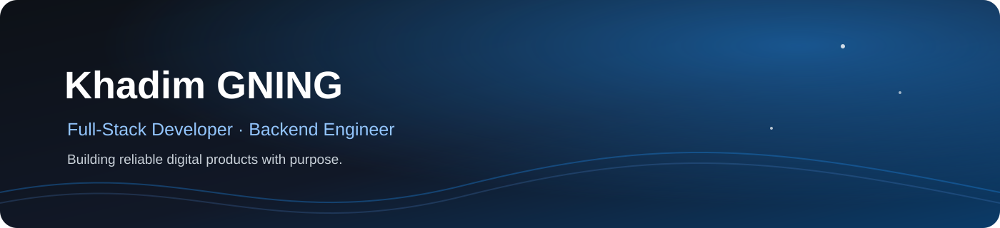

 

# Khadim GNING

### Développeur Full-Stack · Ingénieur Backend · Développeur Mobile & Jeux vidéo

---

## 👋 À propos

Je suis développeur full-stack basé à Dakar. Mon objectif : transformer des idées en produits numériques fiables et agréables à utiliser.

J’interviens sur le web, le mobile, le backend et le jeu vidéo, avec une attention particulière à la clean architecture, à la maintenabilité, à la performance et à l’expérience utilisateur.

> Je conçois des logiciels utiles, scalables et faits pour durer.

## 💼 Ce que je fais

| Backend & APIs | Produits Web & Mobile |
|---|---|
| Services robustes, API REST et architectures backend scalables. | Applications web responsives et expériences mobiles fluides. |

| Product Engineering | Développement de jeux |
|---|---|
| De l’architecture technique et des bases de données jusqu’au déploiement et à l’itération. | Expériences interactives et prototypes de jeux avec Unity et C#. |

---

## 🧰 Stack technique

| Domaine | Technologies |
|:--|:--|
| **Langages** |         |
| **Frontend** |    |
| **Mobile** |  -3DDC84?style=flat-square&logo=android&logoColor=white) -000000?style=flat-square&logo=apple&logoColor=white) |
| **Backend & APIs** |     |
| **Bases de données** |    |
| **Cloud & DevOps** |     |
| **Tests** |   |
| **Développement de jeux** |   |

## 🌱 En cours d’apprentissage

| Domaine | Objectif |
|:--|:--|
|  | Architectures scalables et résilientes : systèmes distribués, cache, files de messages et load balancing |
|  | Infrastructure cloud, serverless et services managés pour la production |
|  | Tests automatisés, pipelines de build et de déploiement pour des mises en production plus rapides et plus sûres |
|  | Systèmes de gameplay, performance et prototypes aboutis avec Unity et C# |

---

## 📊 Statistiques GitHub

<a href="https://github.com/khadimflash?tab=repositories">
  <picture>
    <source media="(prefers-color-scheme: dark)" srcset="./assets/github-stats-dark.svg" />
    <source media="(prefers-color-scheme: light)" srcset="./assets/github-stats-light.svg" />
    
  </picture>
</a>

  

---

## 🤝 Travaillons ensemble

Je suis ouvert aux collaborations sur des produits full-stack, des applications mobiles, des systèmes backend et des projets de jeux indépendants.

Vous avez un produit, une idée de startup ou un projet open source qui a besoin d’un partenaire technique solide ? N’hésitez pas à me contacter.

**[Portfolio](https://tonportfolio.dev)** · **[LinkedIn](https://www.linkedin.com/in/khadim-gning-a8b564282/)** · **[Email](mailto:gningkhadim23@gmail.com)**

  

*Construire avec curiosité, livrer avec intention.*

