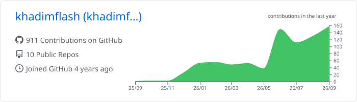

# Khadim GNING

### Full-Stack Developer · Backend Engineer · Mobile & Game Developer

---

## 👋 About Me

I’m a full-stack developer based in Dakar, focused on transforming ideas into reliable and enjoyable digital products.

I work across web, mobile, backend, and game development, with particular attention to clean architecture, maintainability, performance, and thoughtful user experiences.

> I build software that is useful, scalable, and made to last.

## 💼 What I Do

| Backend & APIs | Web & Mobile Products |
|---|---|
| Robust services, REST APIs, and scalable backend architectures. | Responsive web applications and smooth mobile experiences. |

| Product Engineering | Game Development |
|---|---|
| From technical architecture and databases to deployment and iteration. | Interactive experiences and game prototypes with Unity and C#. |

---

## 🧰 Technology I Use

### Languages

### Frontend & Mobile

### Backend, Databases & DevOps

### Testing & Game Development

## 🌱 Currently Learning

---

## 📊 GitHub Analytics

  

 

---

## 🤝 Let’s Work Together

I’m open to collaborations on full-stack products, mobile applications, backend systems, and indie game ideas.

If you have a product, startup idea, or open-source project that needs a strong technical partner, feel free to reach out.

**[Portfolio](https://tonportfolio.dev)** · **[LinkedIn](https://www.linkedin.com/in/khadim-gning-a8b564282/)** · **[Email](mailto:gningkhadim23@gmail.com)**

  

*Building with curiosity, shipping with purpose.*

